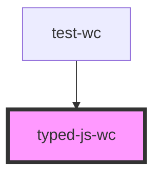

# typed-js-wc

<!-- Auto Generated Below -->

## Properties

| Property  | Attribute | Description | Type     | Default     |
| --------- | --------- | ----------- | -------- | ----------- |
| `options` | `options` |             | `any`    | `undefined` |
| `strings` | `strings` |             | `string` | `undefined` |

## Dependencies

### Used by

 - [test-wc](..\test-wc)

### Graph

----------------------------------------------

*Built with [StencilJS](https://stenciljs.com/)*
